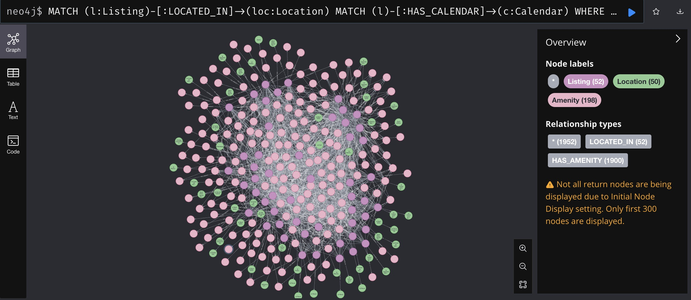
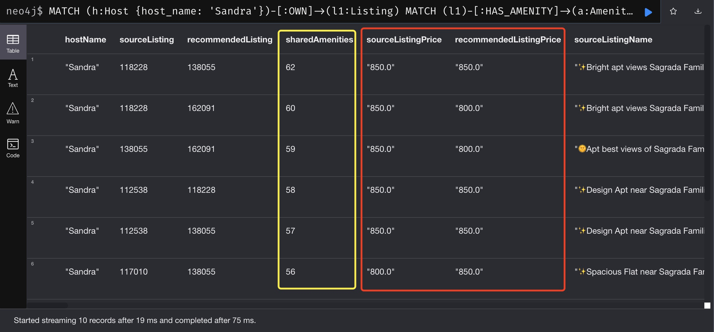
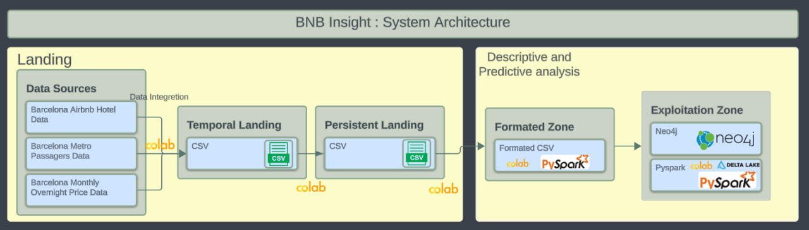

# SDM-Joint-Project

## Overview
The SDM-Joint-Project is designed to leverage Neo4j graph database technologies to manage and analyze property-related data effectively. This project aims to provide advanced analytics for price prediction and property management insights, particularly tailored for Bed and Breakfast owners in the Catalonia area.

## Repository Contents
- `initialize_neo4j_database.py` - Python script to initialize the Neo4j database with the necessary schema and data.
- `bnb_insight_queries.cypher` - Contains Cypher queries for extracting insights from the data.
- `sdm_preprocessing.ipynb` - Jupyter Notebook for preprocessing data used in the project.
- `test.csv` - Sample data file for testing our Property Graph.

## Getting Started
### Prerequisites
- Neo4j (Preferably the latest version)
- Python 3.8+
- Jupyter Notebook or an environment to run .ipynb files (like Google Colab)

### Installation
1. **Clone the repository:**
   ```bash
   git clone https://github.com/yourusername/SDM-Joint-Project.git
   cd SDM-Joint-Project
   
2. **Set up the Neo4j Database:**
   Ensure Neo4j is installed and running on your system.
   Run the initialize_neo4j_database.py to set up the database schema and load initial data.
   
1. **Data Preprocessing：**
   Open the sdm_preprocessing.ipynb notebook in Jupyter or Colab and execute the cells to preprocess the data.

## Relational Graph

https://drive.google.com/file/d/14Wo7hFK97nkzSbsxl63ZpiCw-tWWjaTI/view?usp=sharing


## Query Result Examples
Query properties with air conditioning available


Query properties with ratings higher than 4.5


Query properties and prices near Sagrada Família


Query properties, their locations, prices, and amenities on St. George's Day of Catalonia


## Recommender Result Examples

Recommend properties with similar amenities to the hotel owner named Sandra, and compare these properties' prices and amenities on a specific date.


Recommend properties with similar amenities to the hotel owner named Sandra, and compare these properties' prices and amenities on a specific date.



## Data Pipeline



## Contact
For further assistance, please contact the project maintainer Jintao Ma(mars19990123@gmail.com)

Thank you for following this guide to know our SDM project!

## Contributing

Pull requests are welcome. For major changes, please open an issue first
to discuss what you would like to change.

Please make sure to update tests as appropriate.

## License

[MIT](https://choosealicense.com/licenses/mit/)

